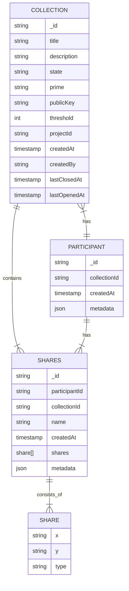

# MassTech

**Table: COLLECTION**

| Name of the Field | Data Type | Description |
| --- | --- | --- |
| _id | string | Automatically given |
| title | string | A title for the collection (e.g., BWWC's gender-wise wage gap) |
| description | string | What this collection is for |
| state | string | Either "open", "closed", or "paused" |
| prime | string | Prime = Field size for cryptography |
| publicKey | string | Public key for de-/encryption |
| threshold | number | The threshold for the minimum submission requirement to preserve security |
| projectId | string | Identifies which project this collection is for and links with the auth service |
| createdAt | timestamp | - |
| createdBy | string | - |
| lastClosedAt | timestamp | - |
| lastOpenedAt | timestamp | - |

**Table: PARTICIPANT**

| Name of the Field | Data Type | Description |
| --- | --- | --- |
| _id | string | Automatically given |
| collectionId | string | Identifier to link to which collection this participation belongs |
| createdAt | timestamp | - |
| metadata | json | BWWC Example: ({ industry: "healthcare", size: "large" }) |

**Table: SHARES**

| Name of the Field | Data Type | Description |
| --- | --- | --- |
| _id | string | Automatically given |
| participantId | string | Identifier to link with participants whose data is encrypted in these shares |
| collectionId | string | Identifier to link with Collection for these shares |
| name | string | Unique name for the set of shares e.g., hispanic_female_executive |
| createdAt | timestamp | - |
| shares | list | List of shares |
| metadata | json | BWWC Example: ({ gender: "female", position: "executive" }) |

**Table: SHARE (not a db table)**

| Name of the Field | Data Type | Description |
| --- | --- | --- |
| x | string | - |
| y | string | - |
| type | string | encrypted/unencrypted |

